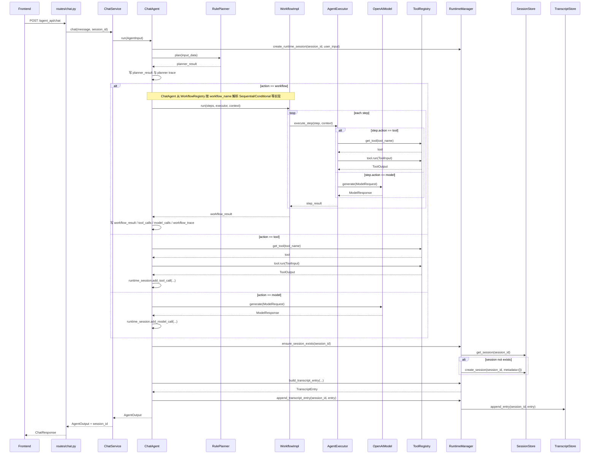
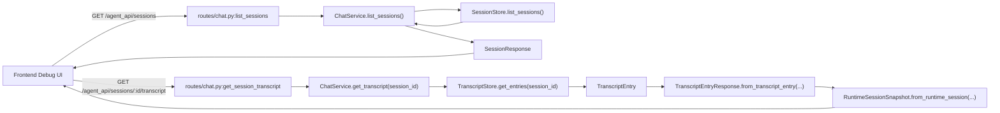

# 自研 Agent 框架设计文档

## 1. 文档定位

本文档用于明确本项目的长期目标、核心设计原则、能力边界与分阶段实施路径。

它不是某一个阶段的开发清单，而是整个自研 Agent 框架项目的总纲。后续所有模块设计、代码实现、阶段计划与重构决策，都应优先与本文档保持一致。

**当前主线说明**：主仓库代码采用 **快速开发迭代** 策略——优先可合并的增量、可回归的测试、以及与本文件和根目录 `README.md` 的同步更新；**不等同于「学习分支」**。文中仍保留「先最小可用再增强」的工程方法，是指范围控制与里程碑拆分，而非以教学演示为首要目标。

**阶段聚焦（当前）**：优先投入 **`backend/app` 自研 Agent 框架**（模型、工具、规划、工作流、Runtime、存储、可观测、扩展点与测试）。**前端展示与调试 UI 非本阶段重点**——保持现有联调能力即可，除非接口契约或配置变更需要最小同步，否则不展开界面与交互迭代。

## 2. 项目总目标

我们的目标是从 0 开始实现一个完整的 Agent 框架。

该框架需要具备主流 Agent 框架的核心能力，包括但不限于：

1. 大模型统一接入与切换能力。
2. Prompt 构建、上下文管理与消息编排能力。
3. Tool Calling 与外部工具调度能力。
4. Memory 管理能力，包括短期记忆与长期记忆。
5. 任务规划、执行、反思与重试能力。
6. Workflow 编排与多步骤任务执行能力。
7. 多 Agent 协作、路由、分工与通信能力。
8. 状态管理、日志、事件追踪、调试与可观测能力。
9. 插件化与可扩展能力，便于接入不同模型、工具、存储与执行策略。

在具备主流框架能力的基础上，我们希望它更加强大，重点体现在以下方面：

1. 更强的可控性。
   开发者能够清楚掌握每一步执行过程，而不是只能得到黑盒结果。
2. 更强的可扩展性。
   框架内部采用清晰分层与标准接口，便于替换和增强任意模块。
3. 更强的可观测性。
   每一次推理、规划、工具调用、状态变化都应可记录、可回放、可调试。
4. 更强的工程化能力。
   框架不仅能做 Demo，还能支持真实系统中的稳定运行、测试、监控与持续迭代。
5. 更强的多 Agent 与工作流能力。
   不局限于单轮问答，而是支持复杂任务拆解、协作执行、自我修正与编排。

## 3. 核心设计原则

### 3.1 分层清晰

框架需要将不同职责拆分清楚，避免所有逻辑都堆积在单一 Agent 类中。

建议的核心分层如下：

1. `Agent`
   面向业务能力的智能体抽象，负责任务接收、状态维护、规划执行与结果输出。
2. `Model`
   统一封装不同大模型供应商的调用方式。
3. `Prompt`
   管理系统提示词、角色消息、上下文压缩与模板渲染。
4. `Tool`
   统一管理工具定义、参数校验、调用执行与结果返回。
5. `Memory`
   管理会话记忆、长期记忆、检索增强与上下文裁剪。
6. `Planner`
   负责任务拆解、步骤规划、执行策略生成。
7. `Runtime`
   驱动 Agent 生命周期，管理事件、状态流转、错误恢复与执行上下文。
8. `Workflow`
   用于定义串行、并行、条件分支、循环、人工介入等复杂流程。
9. `Session / Transcript Store`
   管理 session 元信息与多轮运行记录，为持久化、回放与会话级查询提供基础设施。
10. `Observability`
   提供日志、追踪、事件总线、指标与调试能力。

### 3.2 接口优先

每个核心模块都应先定义抽象接口，再提供默认实现。这样可以避免框架早期被单一实现绑死。

### 3.3 先最小可用，再逐层增强

框架建设必须阶段化推进。先打通最小闭环，再逐步增加规划、记忆、工作流、多 Agent 等高级能力。

### 3.4 默认可观测

执行链路中的关键节点都应天然可追踪，包括：

1. 输入与输出。
2. Prompt 构建结果。
3. 模型请求与响应摘要。
4. 工具调用参数与结果。
5. 计划生成与执行步骤。
6. 错误、重试与中断信息。
7. Prometheus：`GET /metrics` 暴露计数器 **`lcp_planner_route_total`**（标签 **`kind`**：`workflow` / `tool` / `model` / `unknown` / `no_planner`），对应每轮 `planner_result["action"]` 或无 planner 时直走模型；**`lcp_workflow_runs_total`**（`workflow_name`、`outcome`）在 **`ChatAgent._run_workflow`** 结束时记录；若规划为 workflow 但 **`WorkflowRegistry` 未注册**对应名称，则在返回前以 **`outcome=error`** 记一次（与未执行工作流实例一致）。Histogram **`lcp_workflow_duration_seconds`**（同一组标签）仅在真实执行 **`workflow.run`** 的路径上记录耗时。实现见 `backend/app/observability/metrics.py`。
8. Histogram **`lcp_agent_act_duration_seconds`**（标签 **`outcome`**：`success` / `error`）覆盖整轮 **`ChatAgent.act`**（含 lifecycle hooks 与 **`_execute_act`**），与 **`lcp_workflow_duration_seconds`**（仅 workflow 子段）互补；若 **`before_act` / `after_act` / `_execute_act`** 抛出未捕获异常，则 **`outcome=error`** 且 Counter **`lcp_agent_act_exceptions_total`** 加一（异常仍向外抛出）。
9. Histogram **`lcp_planner_plan_duration_seconds`**（`outcome`）记录 **`planner.plan`** 单次调用耗时；无 planner 时不记；**`plan()`** 抛异常时记一次 **`error`** 后仍向上抛出。
10. 未捕获异常：FastAPI 全局 **`Exception`** 处理器在返回 500 统一 JSON 前写 **ERROR** 日志（含 traceback；若存在则附带 **`request_id`**），便于与 **`lcp_agent_act_exceptions_total`** 等指标对照排查。
11. **`lcp_chat_completions_total`**：`POST /agent_api/chat` 在 **`ChatService.chat`** 正常返回时按 **`AgentOutput.success`** 记 **`outcome`**；若 **`chat()`** 抛出未捕获异常，先记 **`error`** 再向上抛出（与 HTTP 500 一致）。路由层同时打 **`app.chat`** 的 **`chat_failed`** 结构化错误日志（含 traceback 与 **`request_id`** / **`session_id`**），与全局 **`unhandled_exception`** 日志互补。

### 3.5 面向生产演进

在快速迭代阶段同样如此：即使单周目标偏「先跑通」，架构上也应预留工程化能力，包括：

1. 配置管理。
2. 超时与重试机制。
3. 统一错误模型（见 **§3.8**，持续与 HTTP / 日志 / 指标对齐）。
4. 测试能力。
5. 并发与异步支持。
6. 持久化与回放能力。

### 3.6 生命周期钩子（对齐 harness hooks / ECC 横切思想）

为 **审计、计费、实验与观测** 预留与业务主链解耦的扩展点，而不把横切逻辑继续堆进 `ChatAgent` 内部：

1. 协议 **`AgentLifecycleHook`**（`before_act` / `after_act`），见 `backend/app/hooks/lifecycle.py`。
2. **`ChatAgent`** 支持构造参数 **`hooks`**，在单轮 `act` 进入核心逻辑前后调用；**约定只读**，避免与 `AgentInput` / `AgentOutput` 契约冲突。
3. **`AgentFactory`** 在 **`AGENT_LIFECYCLE_LOGGING=true`** 时装配 **`LoggingLifecycleHook`**，输出与 `request_id` 可关联的结构化日志（`app.agent.lifecycle`）；**`agent_after_act`** 的 `extra` 含 **`reply_len` / `error_len`**（仅长度，不落原文）及可选 **`error_code`**。
4. **`runtime_session_to_markdown`**（`backend/app/runtime/session_export.py`）：将单轮 **`RuntimeSession`** 导出为 Markdown，便于工单与人工排查（长 JSON / prompt 自动截断）。应用层已提供 HTTP 封装：**`GET .../transcript/{entry_index}/markdown`**（按下标）、**`GET .../transcript/latest/markdown`**（最新一轮）（见 **§11.1**）。
5. 更系统的 **策略表 / hook 插件发现** 见 [`harness-and-ecc-learning-alignment.md`](harness-and-ecc-learning-alignment.md) 中的后续建议。

### 3.7 RulePlanner 与工作流触发配置（JSON + plan builder）

`RulePlanner` 在命中 **workflow 触发规则** 时，会生成带 `steps` 的 `planner_result`（`action: workflow`），与运行时 **`WorkflowRegistry` 按 `workflow_name` 解析具体工作流实现** 是两段衔接：触发 JSON 决定「何时选哪个名字」，**plan builder** 决定「该名字对应的步骤模板」。

1. **默认触发规则**：包内 `backend/app/planners/data/default_workflow_triggers.json`。结构为 `version` + `workflow_triggers[]`；每条含 `workflow_name`、`reason`、`keyword_groups`。匹配语义：**多组之间为 AND**，组内多个关键词为 **OR（子串命中即可）**。
2. **自定义规则文件**：环境变量 **`PLANNER_RULES_PATH`**（对应 `Settings.planner_rules_path`）。若设置，则**必须**指向已存在的 JSON 文件；缺失时启动加载会失败（`FileNotFoundError`），避免误用默认规则。未设置时仍使用包内默认文件。
3. **扩展 plan builder**：在 **`workflow_plan_builders.register_workflow_plan_builder(workflow_name, builder)`** 注册与 JSON 中 **`workflow_name` 字符串一致** 的构建器；构建器负责产出该 workflow 的 `steps` 等片段。执行侧 **`ChatAgent` / `WorkflowRegistry`** 注册的 workflow **类名或注册名**也应与同一 `workflow_name` 对齐，否则规划能命中、执行却解析失败。
4. **可观测性**：`AgentFactory` 在配置了 `planner_rules_path` 时打 **INFO**（logger：`app.agent.factory`），标明将加载的文件路径。若 JSON 中出现未注册 plan builder 的 `workflow_name`，`RulePlanner` 初始化时会打 **WARNING** 并跳过这些规则（logger：`app.planner.rule`），避免静默失效。

### 3.8 统一错误码（ErrorCode）与 Workflow 单步重试/超时

1. **稳定码**：字符串常量见 **`backend/app/schemas/error_codes.py`**（如 **`WORKFLOW_NOT_REGISTERED`**、**`WORKFLOW_STEP_FAILED`**、**`TOOL_NOT_FOUND`**、**`TOOL_TIMEOUT`**、**`MODEL_ERROR`**、**`MODEL_TIMEOUT`**、**`INVALID_INPUT`** 等）。**`AgentOutput.error_code`** 在逻辑失败时尽量填写；**`POST /agent_api/chat`** 的 **`ChatResponse.error_code`** 与之对齐（HTTP 仍为 200 时用于区分「可预期失败」）。
2. **单步重试**：`steps[]` 中可选 **`step_retry_max`**（0～5，默认 0）。默认可重试 **`error_code`** 见 **`DEFAULT_RETRYABLE_STEP_ERROR_CODES`**（**`TOOL_TIMEOUT`**、**`MODEL_TIMEOUT`**）；**`TOOL_NOT_FOUND`**、**`TOOL_ERROR`**、**`MODEL_ERROR`** 等默认不重试。单步可用 **`step_retryable_error_codes`**（字符串数组）覆盖默认集合（例如加入 **`MODEL_ERROR`** 以允许模型瞬时失败重试）；传 **空数组 `[]`** 表示该步**任何**错误码都不重试。每次重试前 **`lcp_workflow_step_retry_attempts_total`**（标签 **`action`**：`tool` / `model` / `unknown`）加一；成功结果中可含 **`retry_count`**（重试次数）。
3. **单步超时**：可选 **`step_timeout_seconds`**（正数秒）。**`tool`** 步骤覆盖 **`AgentExecutor`** 的默认工具超时；**`model`** 步骤在默认 **`model.generate`** 之外增加线程级上限（与工具超时实现方式一致），超时错误码 **`MODEL_TIMEOUT`**。

## 4. 最终希望具备的能力地图

### 4.1 单 Agent 基础能力

1. 支持消息输入与标准化输出。
2. 支持系统提示词、上下文拼接与历史消息管理。
3. 支持同步与异步执行。
4. 支持流式输出。
5. 支持工具调用。
6. 支持结构化输出。

### 4.2 Agent 增强能力

1. 任务规划。
2. 多步执行。
3. 自我反思与修正。
4. 失败重试与兜底策略。
5. 上下文压缩与摘要。
6. 检索增强。

### 4.3 Workflow 能力

1. 顺序执行。
2. 条件分支。
3. 循环执行。
4. 并行执行。
5. 人工确认节点。
6. 失败回滚与补偿。

### 4.4 多 Agent 能力

1. 角色化 Agent 定义。
2. 路由 Agent。
3. 协作 Agent。
4. 监督 Agent。
5. Agent 间消息传递与任务委派。

### 4.5 工程化能力

1. 配置中心。
2. 插件机制。
3. 日志与追踪。
4. 测试框架。
5. 可视化调试能力。
6. 运行时监控。

## 5. 分阶段实施路线

为了实现长期目标，我们需要拆解为多个阶段性小目标，逐步建设。

### 阶段 0：项目基础设施与交互闭环

目标：
建立前后端可运行的基础工程，形成最小产品载体。

阶段成果：

1. 前后端项目结构稳定。
2. 基础聊天 UI 可用。
3. 后端接口契约明确。
4. 请求与响应闭环跑通。

备注：
当前 `docs/stage1-mvp-plan.md` 的内容主要属于这一阶段和下一阶段之间的过渡文档。

### 阶段 1：单 Agent 最小闭环

目标：
实现框架中的第一个可运行 Agent，具备统一输入、调用模型、输出结果的最小能力。

本阶段小目标：

1. 定义 `BaseAgent` 抽象接口。
2. 定义 `BaseModel` 抽象接口。
3. 定义消息对象与执行上下文对象。
4. 打通一个最小的 `run()` 执行链路。
5. 接入一个真实或模拟模型实现。
6. 建立基础日志与错误处理。

验收标准：

1. 可以通过统一接口调用一个 Agent。
2. Agent 能够接收标准输入并返回标准输出。
3. 模型调用逻辑与 Agent 逻辑解耦。

### 阶段 2：Prompt 与上下文管理

目标：
让 Agent 具备更规范的提示词管理与上下文组织能力。

本阶段小目标：

1. 定义消息模型，如 `system`、`user`、`assistant`、`tool`。
2. 实现 Prompt 构建器。
3. 实现会话上下文管理。
4. 实现上下文裁剪或摘要的基础策略。
5. 支持结构化输出约束。

验收标准：

1. Agent 能够稳定管理多轮消息。
2. Prompt 构建逻辑可复用、可测试。
3. 上下文不会无限增长失控。

### 阶段 3：Tool Calling 能力

目标：
让 Agent 能够调用外部工具，完成超出纯文本推理范围的任务。

本阶段小目标：

1. 定义 `BaseTool` 抽象接口。
2. 定义工具注册机制。
3. 定义工具参数 Schema 与校验机制。
4. 实现工具执行器。
5. 实现模型输出到工具调用的解析机制。
6. 支持工具结果回填模型上下文。

验收标准：

1. Agent 能够调用至少一个真实工具。
2. 工具调用链路可记录、可调试。
3. 参数错误、执行失败有统一处理方式。

### 阶段 4：Memory 能力

目标：
让 Agent 拥有短期记忆与长期记忆基础设施。

本阶段小目标：

1. 定义 `BaseMemory` 抽象接口。
2. 实现会话内短期记忆。
3. 实现长期记忆存储接口。
4. 预留向量检索或知识库接入能力。
5. 实现记忆读取与写入策略。

验收标准：

1. Agent 能在多轮会话中保留必要信息。
2. 记忆模块与 Agent 主逻辑解耦。
3. 后续可替换为数据库或向量库实现。

### 阶段 5：规划与执行链路

目标：
让 Agent 从“直接回答”进化为“先思考、再执行、再总结”。

本阶段小目标：

1. 定义 `BasePlanner` 抽象接口。
2. 实现简单任务拆解器。
3. 支持 Plan-and-Execute 模式。
4. 支持 ReAct 风格执行循环。
5. 加入重试、终止条件与步数限制。

验收标准：

1. Agent 可完成多步骤任务。
2. 可清晰看到每一步的计划与执行结果。
3. 能避免无限循环与失控执行。

#### 当前阶段补充：解释性 Trace 已进入主链

在最近的前端调试台演进中，我们又进一步把“可观测信息如何展示”这件事从侧栏堆叠布局，推进到了更清晰的页面分层：

1. 首页右侧现在只保留轻量 `SessionSidebar`，负责会话搜索、概览和详情入口。
2. 完整调试信息被迁到独立 `SessionDetailPage`，承载：
   - transcript 浏览
   - planner 决策摘要
   - workflow trace 时间线
   - runtime snapshot 细节
3. 详情页支持 transcript 级筛选、trace 级筛选以及上一条/下一条 transcript 快捷跳转。

这一步的意义不只是界面优化，更是在架构上明确：

1. 列表视图和完整调试视图应该分层。
2. 调试信息量一旦上来，不应继续强塞在聊天页侧栏里。
3. 前端可视化也应和 runtime / trace 的结构化设计一起演进，而不是单纯展示 JSON。

当前这条链已经不再只是“能执行”，而是开始进入“可解释执行”阶段：

1. `RulePlanner.plan()` 已统一返回稳定的 `planner_result` 结构。
2. `AgentExecutor.execute_step()` 已统一返回 step result 协议，包含：
   - `action`
   - `input_summary`
   - `output_summary`
   - `output`
   - `error`
3. `ChatAgent.act()` 已将 planner 决策写入 runtime trace。
4. `ChatAgent._run_workflow()` 已将 workflow step 级的摘要信息写入 `workflow_trace`。
5. `RuntimeSession.workflow_trace` 现在既能承载 planner 级解释，也能承载 workflow step 级解释。

这意味着我们已经从“有运行记录”进一步进入“运行记录可解释、可展示、可测试”的阶段。

#### 当前代码结构图：模块分层、依赖与主链流转

为了避免后续只凭印象理解框架，我们把当前 `backend/app` 的真实结构再压成三张图：

1. 模块分层图
2. 核心类依赖图
3. 主请求流转图

它们的作用不是追求“完美架构图”，而是帮助我们回答：

1. 当前项目已经有哪些清晰分层。
2. 每一层现在由哪些核心类承担职责。
3. 一次真实请求从入口到运行时再到持久化，究竟怎么流动。

##### 模块分层图

```mermaid
flowchart TB
    subgraph API["API / Entry"]
        main["main.py<br/>FastAPI app"]
        route["routes/chat.py<br/>HTTP routes"]
    end

    subgraph Service["Application Service"]
        chat_service["services/chat_service.py<br/>ChatService"]
        factory["services/agent_factory.py<br/>AgentFactory"]
        settings["config/settings.py<br/>Settings"]
    end

    subgraph AgentLayer["Agent Layer"]
        base_agent["agent/base_agent.py<br/>BaseAgent"]
        chat_agent["agent/chat_agent.py<br/>ChatAgent"]
    end

    subgraph PlannerLayer["Planner Layer"]
        base_planner["planners/base_planner.py<br/>BasePlanner"]
        rule_planner["planners/rule_planner.py<br/>RulePlanner"]
    end

    subgraph WorkflowLayer["Workflow Layer"]
        base_workflow["workflows/base_workflow.py<br/>BaseWorkflow"]
        seq_workflow["workflows/sequential_workflow.py<br/>SequentialWorkflow"]
        cond_workflow["workflows/conditional_workflow.py<br/>ConditionalWorkflow"]
        wf_registry["workflows/workflow_registry.py<br/>WorkflowRegistry"]
        wf_result["workflows/workflow_result.py<br/>WorkflowResult"]
        base_executor["workflows/base_executor.py<br/>BaseExecutor"]
        agent_executor["workflows/agent_executor.py<br/>AgentExecutor"]
    end

    subgraph RuntimeLayer["Runtime / Persistence"]
        runtime_manager["runtime/runtime_manager.py<br/>RuntimeManager"]
        runtime_session["runtime/runtime_session.py<br/>RuntimeSession"]
        transcript_entry["runtime/transcript_entry.py<br/>TranscriptEntry"]

        base_session_store["runtime/base_session_store.py<br/>BaseSessionStore"]
        mem_session_store["runtime/in_memory_session_store.py<br/>InMemorySessionStore"]
        sqlite_session_store["runtime/persistent_session_store.py<br/>PersistentSessionStore"]

        base_transcript_store["runtime/base_transcript_store.py<br/>BaseTranscriptStore"]
        mem_transcript_store["runtime/in_memory_transcript_store.py<br/>InMemoryTranscriptStore"]
        sqlite_transcript_store["runtime/persistent_transcript_store.py<br/>PersistentTranscriptStore"]
    end

    subgraph ToolLayer["Tool Layer"]
        base_tool["tools/base_tool.py<br/>BaseTool"]
        time_tool["tools/time_tool.py<br/>TimeTool"]
        weather_tool["tools/weather_tool.py<br/>WeatherTool"]
        tool_registry["tools/tool_registry.py<br/>ToolRegistry"]
        tool_router["tools/tool_router.py<br/>ToolRouter"]
    end

    subgraph ModelLayer["Model Layer"]
        base_model["models/base_model.py<br/>BaseModel"]
        openai_model["models/openai_model.py<br/>OpenAIModel"]
        mock_model["models/mock_model.py<br/>MockModel"]
    end

    subgraph MemoryPrompt["Memory / Prompt"]
        base_memory["memory/base_memory.py<br/>BaseMemory"]
        in_memory_memory["memory/in_memory_memory.py<br/>InMemoryMemory"]
        base_prompt["prompts/base_prompt.py<br/>BasePrompt"]
        prompt_builder["prompts/prompt_builder.py<br/>PromptBuilder"]
    end

    subgraph SchemaLayer["Schema / Contract"]
        agent_input["schemas/agent_input.py<br/>AgentInput"]
        agent_output["schemas/agent_output.py<br/>AgentOutput"]
        chat_io["schemas/chat_input_output.py<br/>ChatRequest/ChatResponse"]
        model_req["schemas/model_request.py<br/>ModelRequest"]
        model_resp["schemas/model_response.py<br/>ModelResponse"]
        tool_input["schemas/tool_input.py<br/>ToolInput"]
        tool_output["schemas/tool_output.py<br/>ToolOutput"]
        session_response["schemas/session_response.py<br/>SessionResponse"]
        transcript_response["schemas/transcript_response.py<br/>TranscriptEntryResponse"]
        runtime_snapshot["schemas/runtime_snapshot.py<br/>RuntimeSessionSnapshot"]
    end

    main --> route
    route --> chat_service
    chat_service --> settings
    chat_service --> factory
    factory --> chat_agent
    factory --> openai_model
    factory --> rule_planner
    factory --> tool_registry
    factory --> tool_router
    factory --> time_tool
    factory --> weather_tool
    factory --> prompt_builder
    factory --> in_memory_memory
    factory --> runtime_manager
    factory --> mem_session_store
    factory --> sqlite_session_store
    factory --> mem_transcript_store
    factory --> sqlite_transcript_store
```



##### 核心类依赖图

```mermaid
classDiagram
    class ChatService {
      +chat(message, session_id)
      +list_sessions()
      +get_transcript(session_id)
    }

    class AgentFactory {
      -_session_store
      -_transcript_store
      -_memory
      -_prompt_builder
      -_runtime_manager
      +create_chat_agent(settings)
      +get_session_store()
      +get_transcript_store()
    }

    class BaseAgent {
      <<abstract>>
      +act(input_data)
      +run(input_data)
    }

    class ChatAgent {
      -_tool_registry
      -_workflow_registry
      -_memory
      -_prompt_builder
      -_planner
      -_runtime_manager
      +act(input_data)
      +call_tool(tool_name, tool_input)
      +call_model(input_data)
    }

    class BasePlanner {
      <<abstract>>
      +plan(input_data, context)
    }

    class RulePlanner {
      -_tool_router
      +plan(input_data, context)
      -_should_use_sequential_workflow(message)
      -_should_use_conditional_workflow(message)
    }

    class BaseWorkflow {
      <<abstract>>
      +run(steps, executor, context)
    }

    class SequentialWorkflow {
      +run(steps, executor, context)
    }

    class ConditionalWorkflow {
      +run(steps, executor, context)
    }

    class WorkflowRegistry {
      +register(name, factory)
      +get(name)
    }

    class WorkflowResult {
      +to_dict()
    }

    class BaseExecutor {
      <<abstract>>
      +execute_step(step, context)
    }

    class AgentExecutor {
      -_model
      -_tool_registry
      +execute_step(step, context)
      -_build_step_result(...)
    }

    class RuntimeManager {
      -_session_store
      -_transcript_store
      +create_runtime_session(session_id, user_input)
      +ensure_session_exists(session_id)
      +build_transcript_entry(...)
      +append_transcript_entry(...)
    }

    class RuntimeSession {
      +session_id
      +user_input
      +planner_result
      +workflow_result
      +tool_calls
      +model_calls
      +workflow_trace
      +final_output
      +errors
      +add_tool_call(...)
      +add_model_call(...)
      +add_workflow_step_trace(...)
      +to_dict()
    }

    class TranscriptEntry {
      +type
      +user_input
      +final_output
      +success
      +timestamp
      +runtime_session
      +to_dict()
    }

    class BaseSessionStore {
      <<abstract>>
      +create_session(...)
      +get_session(...)
      +list_sessions()
    }

    class InMemorySessionStore
    class PersistentSessionStore

    class BaseTranscriptStore {
      <<abstract>>
      +append_entry(...)
      +get_entries(...)
      +clear(...)
    }

    class InMemoryTranscriptStore
    class PersistentTranscriptStore

    class BaseModel {
      <<abstract>>
      +generate(input_data)
    }

    class OpenAIModel
    class MockModel

    class BaseMemory {
      <<abstract>>
      +add_message(...)
      +get_messages(...)
      +clear(...)
    }

    class InMemoryMemory

    class BasePrompt {
      <<abstract>>
      +build_prompt(...)
    }

    class PromptBuilder

    class ToolRegistry {
      +register_tool(tool)
      +get_tool(name)
    }

    class ToolRouter {
      +route(input_text)
      +add_rule(tool_name, keywords)
    }

    class BaseTool {
      <<abstract>>
      +run(tool_input)
      +execute(tool_input)
    }

    class TimeTool
    class WeatherTool

    ChatService --> AgentFactory
    AgentFactory --> ChatAgent
    AgentFactory --> RuntimeManager
    AgentFactory --> OpenAIModel
    AgentFactory --> RulePlanner
    AgentFactory --> ToolRegistry
    AgentFactory --> ToolRouter
    AgentFactory --> PromptBuilder
    AgentFactory --> InMemoryMemory
    AgentFactory --> InMemorySessionStore
    AgentFactory --> PersistentSessionStore
    AgentFactory --> InMemoryTranscriptStore
    AgentFactory --> PersistentTranscriptStore

    ChatAgent --|> BaseAgent
    RulePlanner --|> BasePlanner
    SequentialWorkflow --|> BaseWorkflow
    ConditionalWorkflow --|> BaseWorkflow
    AgentExecutor --|> BaseExecutor
    OpenAIModel --|> BaseModel
    MockModel --|> BaseModel
    InMemoryMemory --|> BaseMemory
    PromptBuilder --|> BasePrompt
    TimeTool --|> BaseTool
    WeatherTool --|> BaseTool
    InMemorySessionStore --|> BaseSessionStore
    PersistentSessionStore --|> BaseSessionStore
    InMemoryTranscriptStore --|> BaseTranscriptStore
    PersistentTranscriptStore --|> BaseTranscriptStore

    ChatAgent --> BasePlanner
    ChatAgent --> PromptBuilder
    ChatAgent --> BaseMemory
    ChatAgent --> ToolRegistry
    ChatAgent --> WorkflowRegistry
    ChatAgent --> RuntimeManager
    ChatAgent --> SequentialWorkflow
    ChatAgent --> ConditionalWorkflow
    ChatAgent --> AgentExecutor
    ChatAgent --> RuntimeSession

    RulePlanner --> ToolRouter
    AgentExecutor --> BaseModel
    AgentExecutor --> ToolRegistry
    RuntimeManager --> BaseSessionStore
    RuntimeManager --> BaseTranscriptStore
    RuntimeManager --> RuntimeSession
    RuntimeManager --> TranscriptEntry
    ToolRegistry --> BaseTool
```



##### 主请求流转图



##### 查询链流转图



##### 如何使用这组图

如果后面要继续完善框架本身，这组图最适合拿来做三件事：

1. 看依赖是否开始穿层。
   例如 route 是否开始直接碰 runtime，或者 workflow 是否开始直接操作 store。
2. 看抽象是否已经落地。
   例如我们现在已经有：
   - `BaseAgent`
   - `BasePlanner`
   - `BaseWorkflow`
   - `BaseExecutor`
   - `BaseMemory`
   - `BaseModel`
   - store 抽象
3. 看下一步最该补哪一层。
   当前最值得继续深化的通常是：
   - workflow 抽象与扩展（并行、循环、checkpoint、与注册表策略）
   - runtime / event / replay
   - store 查询与摘要能力

### 阶段 6：Workflow 编排能力

目标：
让框架支持复杂任务编排，而不只依赖单一 Agent 内部逻辑。

本阶段小目标：

1. 定义工作流节点抽象。
2. 支持串行、并行、条件分支。
3. 支持人工确认节点。
4. 支持节点级状态管理。
5. 支持失败恢复与补偿机制的初版。

验收标准：

1. 可以通过工作流描述复杂执行路径。
2. 工作流执行状态可追踪。
3. 工作流节点可复用。

### 阶段 7：多 Agent 协作

目标：
让框架具备多个 Agent 间协同工作的能力。

本阶段小目标：

1. 定义 Agent 注册与发现机制。
2. 实现路由 Agent。
3. 实现监督者 Agent。
4. 实现任务委派与结果回收机制。
5. 定义 Agent 间通信协议。

验收标准：

1. 多个 Agent 可以围绕同一任务协作。
2. 路由与委派过程可追踪。
3. 失败 Agent 不会导致整体流程完全不可控。

### 阶段 8：可观测性与工程化增强

目标：
让框架真正具备可调试、可测试、可维护、可演进的工程能力。

本阶段小目标：

1. 建立统一日志体系。
2. 建立事件模型与执行轨迹追踪。
3. 支持回放与调试视图。
4. 建立单元测试、集成测试与回归测试基线。
5. 实现配置管理、环境隔离与基础性能监控。

验收标准：

1. 一次复杂执行可以被完整追踪。
2. 核心模块都有测试覆盖。
3. 框架具备长期演进基础。

## 6. 当前建议的优先级

从现在开始，建议按照以下顺序推进：

1. 完成 `BaseAgent`、`BaseModel`、消息对象、运行上下文的抽象设计。
2. 打通单 Agent 最小可运行链路。
3. 再补 Prompt 管理与 Tool Calling。
4. 在单 Agent 稳定后再引入 Memory、Planner、Workflow、多 Agent。

原因：

1. 单 Agent 是整个框架的基础。
2. 如果基础抽象不稳，后续所有高级能力都会返工。
3. 先打通主链路，才能更容易验证接口设计是否合理。

## 7. 当前阶段的落地任务建议

> 下列条目写于「runtime / store 主链尚未完全合入」时期；其中第 4～6 条及顺序工作流主链等**已在 §8 落地**。保留为「仍可持续打磨」的检查单，而不是未开始的空白项。

结合现状，下一批最值得实现的小目标如下：

1. 继续清理 `ChatAgent`、`Planner`、`Workflow` 之间的职责边界（含注册表解析、条件分支与 trace 一致性）。
2. 将 `Workflow` 与 `Executor` 更自然地接入更高层的 Agent 主流程（含失败策略、上下文传递约定）。
3. 为工作流步骤执行、步骤结果传递补更稳的断言型测试。
4. ~~引入最小 `RuntimeSession`~~（已有）：继续丰富字段语义与序列化边界。
5. 逐步将 `RuntimeSession` 演进为可序列化、可聚合的 runtime snapshot（与 `RuntimeSessionSnapshot` 对外协议对齐）。
6. ~~为后续 `TranscriptStore / SessionStore` 预留接口~~（已接入）：转向查询、摘要与跨进程恢复等增强。
7. 逐步从「规则版规划 + 顺序/条件工作流」演进到更强多步编排（并行、循环、人工节点）。
8. 为后续 `Observability` 和多 Agent 协作继续预留接口。

## 8. 当前阶段状态

当前项目状态判断如下：

1. 基础前后端工程与聊天交互闭环已经具备。
2. `BaseAgent`、`BaseModel`、统一输入输出协议已经落地，并已接入真实模型。`BaseAgent.run()` 在校验失败时返回结构化 `AgentOutput`（`success=False`，`metadata.failure_kind=invalid_input`），便于 HTTP 与内部调用统一处理，而非抛 `ValueError`。
3. `BaseTool`、`ToolRegistry`、`ToolRouter` 与示例工具 `TimeTool`、`WeatherTool` 已落地，规则版工具调用链路已跑通。
4. `BaseMemory` 与 `InMemoryMemory` 已落地，短期会话记忆已经接入 `ChatAgent` 主流程。
5. 普通聊天分支已经可以读取最近历史消息并拼接进模型输入，形成最小多轮上下文能力。
6. `BasePlanner` 与 `RulePlanner` 已落地，`ToolRouter -> RulePlanner -> ChatAgent` 的规划执行链路已跑通；`planner_result` 除 `tool` / `model` 外可下发 `action: workflow` 与 `workflow_name`。workflow 触发条件与关键词组可由 **`PLANNER_RULES_PATH`** 外置 JSON 配置（见 **§3.7**），步骤模板由 **`register_workflow_plan_builder`** 与 `workflow_name` 对齐扩展。
7. `BaseWorkflow`、`SequentialWorkflow`（顺序执行、单步失败即结束并返回失败汇总）、`ConditionalWorkflow`（按步骤条件选择后继，便于失败兜底分支）、`WorkflowRegistry`（按名解析工作流实例）、`WorkflowResult`（统一工作流输出并写入 `RuntimeSession.workflow_result`）、`BaseExecutor` 与 `AgentExecutor` 已落地。
8. Workflow 已支持步骤结果传递；顺序流在失败时短路返回，条件流可按 `condition` 跳过或执行不同模型/工具步骤。
9. `RuntimeSession` 已落地，并接入 `ChatAgent`，可记录单轮输入、规划结果、`workflow_trace`、工具/模型调用、最终输出与错误摘要。
10. `TranscriptEntry` 已落地，Transcript 记录已从约定 dict 收敛为明确的数据对象。
11. `BaseTranscriptStore`、`InMemoryTranscriptStore` 已落地，`ChatAgent` 已可在每轮运行结束后追加统一结构的 `agent` 记录。
12. `BaseSessionStore`、`InMemorySessionStore` 已落地，`ChatAgent` 已可在 transcript 写入前确保 session 存在。
13. `RuntimeManager` 已落地，并开始统一协调 `RuntimeSession`、`TranscriptEntry`、`TranscriptStore` 与 `SessionStore`。

当前阶段应统一定义为：

`阶段 5、阶段 6 与 Runtime Store 过渡阶段：规则规划、最小工作流、执行层、运行快照与最小会话记录基础设施已成立`

这一阶段的核心目标不再只是“工具调用 + 短期记忆”，而是把规划层、工作流层和执行层真正接回主流程，重点包括：

1. `Planner` 与 `ToolRouter` 的边界稳定化。
2. `Workflow` 与 `Executor` 的顺序执行链路稳定化。
3. 步骤结果传递能力稳定化。
4. `RuntimeSession` 作为最小 runtime 观测对象稳定接入主链。
5. `TranscriptStore` 作为多轮运行记录层稳定接入主链。
6. `SessionStore` 作为 session 元信息层稳定接入主链。
7. `RuntimeManager` 作为 runtime 协调层开始从 `ChatAgent` 中接管会话与 transcript 记录链。
8. 为未来的 canonical runtime snapshot 设计预留空间。
9. `ChatAgent`、`Planner`、`Workflow`、`Executor`、`RuntimeManager`、`SessionStore` 与 `TranscriptStore` 的职责边界持续收清。
10. 在已有条件分支 workflow 初版之上，继续为 Runtime 深化、循环/并行/人工节点、多步编排与多 Agent 能力打地基。

补充说明：

结合对 `student/everything-claude-code` 的学习，后续 Runtime 设计应重点关注以下演进方向：

1. `RuntimeSession` 与“对外标准快照协议”分层。
   当前 `RuntimeSession` 适合作为框架内部运行对象，后续再演进到面向持久化、回放、UI 与控制层的 canonical snapshot。
2. Session Adapter 思维。
   不同来源的运行信息后续可先经 adapter 归一化，再进入统一快照结构，而不是让上层直接依赖具体 harness 或具体执行器的私有格式。
3. Skills-first / Workflow-surface 思维。
   后续除了内核抽象，还要逐步思考“哪些能力应成为长期稳定的工作流表面”，而不是把所有触发方式都固化成命令壳。
4. Agent-first orchestration policy。
   多 Agent 不是只增加代理数量，而是要进一步定义：什么时候调谁、如何路由、如何组合，以及默认的协作策略。

后续如果没有明确说明，所有实现优先级都应服从这一阶段目标。

## 9. 文档使用约定

1. 后续新增阶段文档时，应与本文档的阶段划分保持一致。
2. 如果阶段目标发生变化，应优先更新本文档，再更新具体阶段计划。
3. 如果某个模块实现与本文档冲突，应先讨论并修订设计，再继续编码。

## 10. 下一阶段实现顺序

在当前 `RuntimeSession + TranscriptEntry + TranscriptStore + SessionStore + RuntimeManager`
已经成立的前提下，后续实现顺序应尽量保持克制，优先按以下路线推进：

1. `AgentFactory`
   职责：把 `ChatService` 中的依赖组装职责提出来，形成清晰的组装根。
2. 查询能力
   职责：让 `SessionStore / TranscriptStore` 从“会记录”变成“可读取”。已落地 `list_sessions()`、`SessionStore.get_session(session_id)`、`get_transcript(session_id)`，并由 `ChatService` / HTTP 暴露（见 **§11.1**）。
3. 标准快照协议
   职责：让 `RuntimeSession / TranscriptEntry` 提供稳定、可序列化的对外结构。
4. 持久化 Store
   职责：把当前内存版记录层逐步推进到可落盘、可重启恢复的实现。
   当前进展：SQLite 版 `PersistentSessionStore` 与 `PersistentTranscriptStore` 已进入第一版实现与测试阶段，当前重点是先守住接口兼容、最小读写闭环与后续替换能力。
   补充进展：`AgentFactory` 已支持 memory/sqlite store 切换，`ChatService` 默认实例也已开始从配置来源读取 `STORE_BACKEND / RUNTIME_DB_PATH`，sqlite 模式下的最小 service 级集成验证已经跑通。
   进一步进展：sqlite 模式下已经验证可跨 `ChatService` 实例恢复 session 与 transcript，说明当前持久化链已不只是“同实例可读”，而是具备最小重建恢复能力。
6. 配置收口
   职责：把分散在 service/factory 中的环境变量读取逻辑统一收口到 `Settings`，形成清晰的配置入口。
5. 可视化与调试能力
   职责：让 session、transcript、runtime snapshot 记录真正可被查看、分析与调试。
   当前进展：除 JSON transcript 外，已提供 **最新一轮** `RuntimeSession` 的 **Markdown 导出** HTTP 接口（与 `runtime_session_to_markdown` 一致，见 **§11.1**）；根目录 `README.md` 的 API 说明已同步。

这条顺序的核心原则是：

1. 先收口组装根。
2. 再打通读取链路。
3. 再统一快照协议。
4. 最后再进入持久化与可视化阶段。

如果没有明确的新优先级，后续实现应优先服从这条路线，而不是继续零散增加功能点。

## 11. 应用层组装边界

当前系统已经不只是“Agent 内核模块集合”，而是开始形成完整的应用层调用链：

```text
route
  -> chat service
  -> agent factory
  -> chat agent
  -> planner / workflow / executor
  -> runtime manager
  -> session / transcript stores
```

这一层分工的核心原则是：

1. `route`
   职责：只负责 HTTP 请求校验、调用 service、返回统一响应。
2. `ChatService`
   职责：只负责业务调用、统一 `session_id`、对外暴露应用层接口（会话与 transcript 的只读查询、最新一轮 Markdown 导出等，路由见 **§11.1**）。
3. `AgentFactory`
   职责：负责组装 `ChatAgent` 及其依赖，是应用层组装根，而不是 Agent 框架内核的一部分。
   当前进展：已支持根据配置在 `InMemory*Store` 与 SQLite 持久化 store 之间切换。
4. `Settings`
   职责：负责统一承载应用启动配置，并把模型配置、store backend 与 runtime db 路径向下传递给 `ChatService` 和 `AgentFactory`。
5. `ChatAgent`
   职责：负责单轮推理主链执行，不再承担应用层组装职责。
6. `RuntimeManager`
   职责：负责 runtime 记录链路协调，不直接承担 HTTP 或业务入口职责。

后续如果继续扩展，不应让 `route` 和 `ChatService` 直接感知过多底层实现细节，而应继续通过组装根把依赖关系收口。

### 11.1 HTTP 应用层只读与调试接口

实现位置：`backend/app/routes/chat.py`，只读开关依赖：`backend/app/routes/deps.py` 中 **`require_read_api`**（读取 `Settings.agent_read_api_enabled`，对应环境变量 **`AGENT_READ_API_ENABLED`**，默认 **开启**）。关闭时上述 **GET** 返回 **403**（`FORBIDDEN`），**`POST /chat` 不经过该依赖**。启动时配置由 `main.lifespan` 注入 **`app.state.settings`**。

URL 前缀由 `app.main` 挂载为 **`/agent_api`**。OpenAPI 与 Try it out：**`GET /docs`**（FastAPI Swagger UI）。

| 方法 | 路径 | 说明 |
|------|------|------|
| POST | `/chat` | 单轮对话；可带请求头 **`X-Request-ID`**，响应头回显同一 ID。 |
| GET | `/sessions` | 会话元信息列表。 |
| GET | `/sessions/{session_id}` | 单条 session；不存在时 404。 |
| GET | `/sessions/{session_id}/transcript` | transcript JSON（`TranscriptEntryResponse`，内含 `RuntimeSessionSnapshot`）。 |
| GET | `/sessions/{session_id}/transcript/{entry_index}/markdown` | 按 **0-based** 下标导出某一 transcript 条目的 `RuntimeSession` Markdown；越界或无可导出时 404；下标为负时 422。 |
| GET | `/sessions/{session_id}/transcript/latest/markdown` | **最新一条** transcript 对应轮次的 `RuntimeSession` Markdown（`text/markdown`），内核实现为 `runtime_session_to_markdown`；无记录时 404。 |

规则规划外置配置、workflow 触发与扩展仍见 **§3.7**；环境变量总表见 `Settings.from_env` 与根目录 **`README.md`** 后端环境变量说明。

根路径 **`GET /health`**（非 `/agent_api`）返回 `status`、`api_version`、`metrics_enabled`、`agent_read_api_enabled`，供存活探针与运维快速确认只读接口开关；**`api_version`** 与 FastAPI/OpenAPI 版本字段同源，见 **`backend/app/version.py`**（`API_VERSION`）。

## 12. LangChain 值得学习的地方

结合当前我们自己的框架演进，LangChain 有几类特别值得学习的点：

1. 标准化模型接口
   LangChain 强调统一模型接口，降低 provider 差异带来的耦合成本，这一点非常值得我们继续坚持到 `BaseModel` 抽象上。

2. 工具与模型能力的统一编排表面
   LangChain 把 tools、messages、agents 放在统一使用表面上，让“换模型、换工具、换 provider”这件事更平滑。我们自己的 `ToolRegistry / ToolRouter / Planner / ChatAgent` 也应继续沿着这个方向收口。

3. 从高层易用抽象到低层可控 runtime 的分层
   LangChain 官方当前明确区分了高层 LangChain agent 与更低层的 LangGraph runtime/orchestration，这一点很值得学习。我们的 `ChatAgent -> Workflow/Executor -> RuntimeManager` 也应继续保持这种分层，不要把所有控制逻辑堆回一个对象里。

4. 记录、调试、观测是框架一等公民
   LangChain 官方非常强调 tracing、debugging、observability，这和我们现在推进 `RuntimeSession / TranscriptEntry / SessionStore / TranscriptStore` 的方向高度一致。后续不应把记录层当成附属功能，而要继续把它当成主链能力建设。

5. 先提供简单入口，再逐步开放高级能力
   LangChain 的一个优点是既有容易上手的入口，也保留向更复杂 orchestration 演进的空间。对我们来说，这意味着：
   - 现在先保持 `ChatService / ChatAgent` 的简单入口
   - 后续再逐步引入 `AgentFactory`、查询能力、快照协议、持久化与 replay

6. 明确框架内核和应用层组装根的边界
   这点对我们尤其重要。LangChain 本身提供框架能力，但应用如何装配、如何接业务入口、如何接 deployment / observability，是另外一层。我们的 `AgentFactory` 也应该站在这一层，而不是继续混进 Agent 内核。

如果继续沿着这些点演进，我们的目标不是“照着 LangChain 复刻”，而是学习它在：

- 抽象边界
- runtime 分层
- 记录与调试
- 高层易用性和底层可控性的平衡

这几方面的工程取舍。

### 12.1 LangGraph 值得学习的地方

如果把视角进一步从 LangChain 高层抽象下沉到 LangGraph runtime/orchestration，那么还有几类特别值得我们吸收的思想：

1. `state` 作为统一运行时承载对象
   LangGraph 的核心不是“多几个节点”，而是让整条执行链围绕一份共享 `state` 流转。对我们来说，这一点最直接的映射就是 `RuntimeSession`。
   后续演进方向应是：
   - `RuntimeSession` 继续承担内部共享状态对象的角色
   - 各执行步骤明确自己读取哪些字段、写回哪些字段

2. `node` 与业务步骤解耦
   LangGraph 把流程拆成 node，每个 node 负责一小段明确处理逻辑。对我们来说，当前已经有 node 雏形：
   - planner step
   - tool step
   - model step
   - workflow step
   - executor step
   后续如果引入更复杂 workflow，不应继续把所有逻辑堆回 `ChatAgent`，而应逐步把步骤职责显式化。

3. `edge` 与路由规则显式化
   LangGraph 的价值不只是执行节点，更重要的是把“下一步去哪里”变成显式边和条件。对我们来说，这对应的是：
   - `RulePlanner` 的 action 路由
   - workflow 中的步骤顺序
   - 后续条件分支、失败 fallback、重试策略
   这意味着未来如果系统继续复杂化，控制流不应继续只靠分散的 `if/else`，而要逐步显式建模。

4. 状态转移与执行过程分层
   LangGraph 很强调：
   - node 负责执行
   - state 负责承载
   - graph/edge 负责转移
   这对我们非常重要。我们当前的合理演进方向应是：
   - `Workflow / Executor` 负责执行
   - `RuntimeSession` 负责状态承载
   - planner / workflow 定义负责转移决策
   - `RuntimeManager` 负责记录链协调

5. 为循环、分支和多 agent 预留 graph 化能力
   LangGraph 真正强的地方在于：
   - 条件分支
   - 循环
   - checkpoint
   - 多 agent orchestration
   我们当前不应该直接照搬这些能力，但后续设计时应为这些方向保留空间，尤其是在：
   - workflow step 定义
   - runtime trace
   - transcript snapshot
   - orchestration policy
   上避免过早写死。

6. 先保留 graph 思维，再决定何时 graph 化
   当前阶段我们最正确的做法，不是立刻引入完整 graph runtime，而是先保持 graph 思维：
   - `RuntimeSession` 像 state
   - planner/tool/model/workflow step 像 node
   - 规则分流与步骤跳转像 edge
   等条件分支 workflow、retry、fallback、多 agent 需求变强时，再决定是否显式引入 graph 结构。

对我们来说，LangGraph 最值得学习的并不是“图很高级”，而是：

- 统一状态对象
- 显式步骤节点
- 显式转移规则
- 控制流与执行层分开

这四点会直接决定我们后续 workflow、runtime、orchestration 是否能继续健康演进。

## 13. 快速迭代协作约定（当前主线）

主仓库处于 **快速开发迭代** 阶段：以可合并的增量、端到端可验证的行为、以及文档同步为默认标准，**不以「学习分支」或教案式推进为首要目标**。

协作约定：

1. **交付优先**：在尊重分层与接口边界的前提下，优先打通可演示、可回归的闭环。
2. **文档同步**：影响对外 API、配置、主链路或部署方式的改动，应同步更新根目录 `README.md` 与本设计文档中的对应小节。
3. **兼容与迁移**：涉及 schema、存储格式或路由的变更，在 PR / 提交说明中写清兼容策略或迁移步骤。
4. **默认可观测**：新能力尽量接入现有 `RuntimeSession`、日志或同类观测通路，便于迭代期定位问题。
5. **测试护栏**：关键路径优先用自动化测试锁住行为，减少仅靠手工点按的回归。

AI 协作角色定义为 **工程协作方**：以设计取舍说明、实现拆解与评审式反馈为主；知识讲解服务于交付质量与可维护性，而非单独作为项目节奏的主线目标。

工程习惯上仍建议：核心模块先明确职责与接口目的；新增能力说明其在框架中的位置；重构时说明旧设计的局限与新方案解决的问题。

## 14. 结语

这个项目不是简单封装一次模型调用，而是要逐步构建一个真正可扩展、可观测、可工程化的 Agent 框架。

因此我们后续的每一步实现，都要服务于这个长期目标：在快速迭代中持续演进为完整、可工程化的智能体系统框架。
